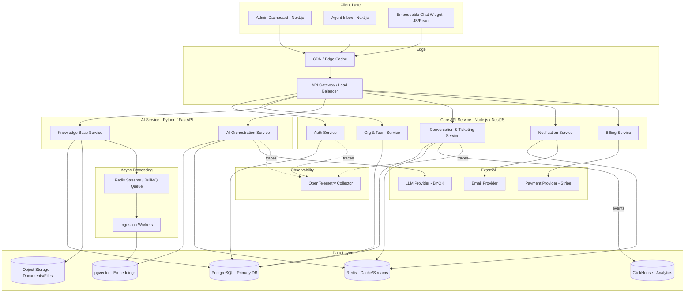
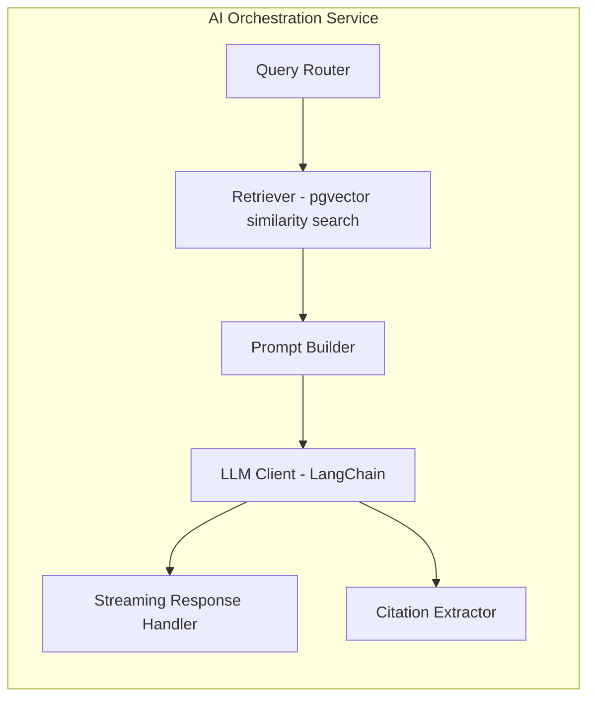
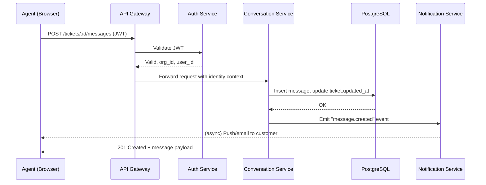
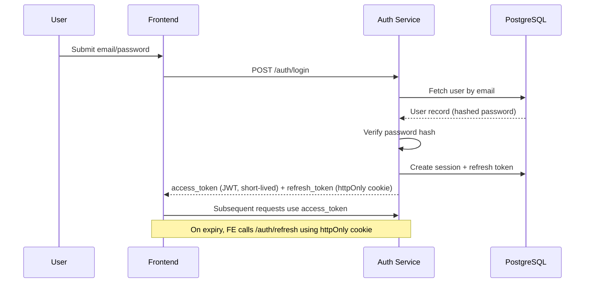
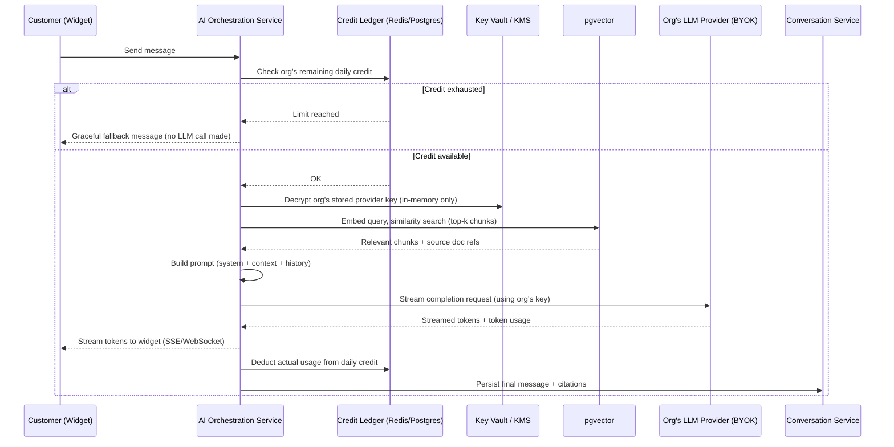
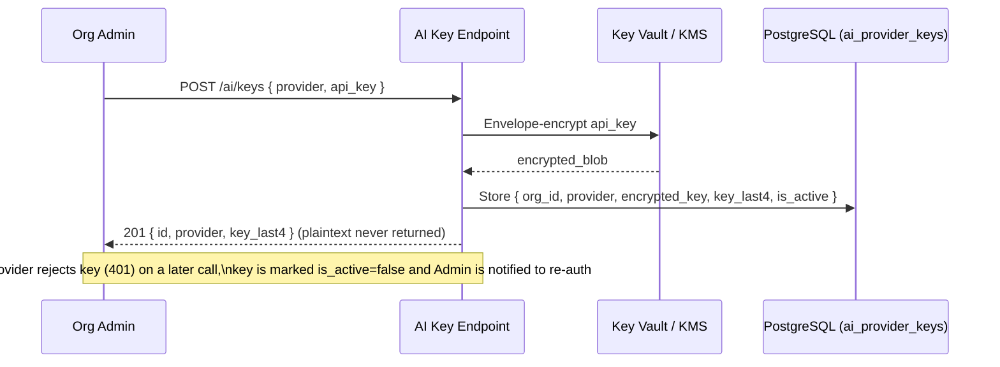
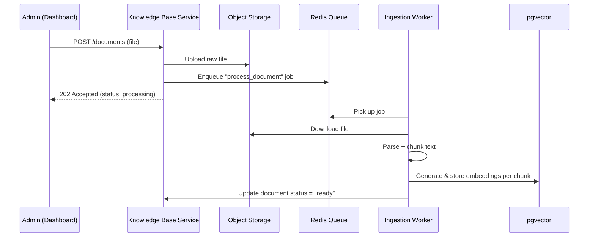
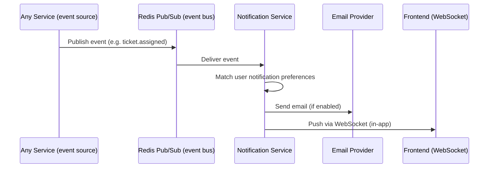

# SupportGPT — Architecture & Product Documentation

## Phase 1 — Product Planning

### Problem Statement
Companies handling customer support today juggle disconnected tools: a helpdesk for tickets, a separate chatbot vendor for AI responses, and a third analytics tool to measure quality. Support teams spend excessive time on repetitive questions that a well-trained AI assistant grounded in the company's own documentation could resolve instantly, while human agents should be freed to handle complex, high-value cases. SupportGPT unifies knowledge management, AI-powered conversational support, ticketing, and analytics into a single platform so companies can deploy an AI support agent trained on their own content, escalate seamlessly to humans, and measure the effectiveness of both.

### Target Users
- **B2B SaaS companies** (10–500 employees) needing scalable customer support without linearly scaling headcount.
- **E-commerce businesses** with high support volume around order status, returns, and product questions.
- **Internal IT/HR helpdesks** wanting an AI-assisted internal knowledge base.
- **Support agencies / BPOs** managing support for multiple client organizations.

### User Personas

**1. Priya — Head of Customer Support (Decision Maker)**
Manages a team of 12 agents. Wants to reduce average response time and ticket backlog, and needs analytics to report ROI to leadership.

**2. Daniel — Support Agent (Daily User)**
Handles escalated tickets. Wants a unified inbox, AI-suggested replies, and full conversation context without switching tools.

**3. Sarah — Engineering/Product Lead (Technical Admin)**
Responsible for onboarding the org, uploading documentation, configuring the AI assistant's behavior, and managing API/webhook integrations.

**4. Alex — End Customer (Indirect User)**
Interacts with the AI widget on the company's website or app. Wants fast, accurate answers, and a smooth handoff to a human when needed.

### Business Goals
- Reduce average first-response time by 70%+ via AI-first triage.
- Deflect 40–60% of repetitive tickets without human involvement.
- Provide organizations with measurable analytics (CSAT, resolution time, AI accuracy) to justify subscription cost.
- Support a multi-tenant, usage-based (seat + AI-usage) pricing model.

### Functional Requirements
- Organization creation, team invitations, and role-based access control.
- Knowledge base document upload (PDF, DOCX, URLs, plain text) with chunking and embedding.
- AI chat assistant that answers using Retrieval-Augmented Generation (RAG) grounded in the org's knowledge base, with citations.
- **BYOK (Bring Your Own Key)**: each org supplies and manages its own LLM provider API key(s); the platform enforces a per-org daily credit/usage limit rather than metering LLM cost itself.
- Live chat widget embeddable on customer websites.
- Ticket creation, assignment, status/priority management, and escalation from AI to human.
- Conversation history, tagging, and search.
- Analytics dashboards: CSAT, response time, ticket volume, AI deflection rate, agent performance.
- Notifications (in-app, email, and optionally Slack) for ticket assignment, mentions, and SLA breaches.
- Billing and subscription management per organization.

### Non-Functional Requirements
- **Multi-tenancy**: strict data isolation between organizations.
- **Scalability**: support orgs ranging from 5 to 5,000+ end-customer conversations/day.
- **Availability**: 99.9% uptime target for chat and ticketing services.
- **Latency**: AI response streaming should begin within ~1–2 seconds.
- **Security**: encryption at rest and in transit, SOC 2-aligned access controls, audit logging. Customer-supplied LLM API keys (BYOK) must be envelope-encrypted via a KMS, decrypted only in-memory at call time, and never exposed in logs or API responses after creation.
- **Extensibility**: pluggable AI provider layer (not locked to a single LLM vendor).
- **Observability**: centralized logging, tracing, and error monitoring.

### MVP Scope
- Auth (email/password + Google OAuth), org creation, single-role invites (Admin/Agent).
- Knowledge base upload (PDF/DOCX/text) → chunk → embed → store in pgvector.
- AI chat widget with RAG + streaming + citations, no multi-turn memory beyond a single conversation.
- BYOK key entry (single provider key per org) + daily credit limit enforcement with a hard cutoff and dashboard warning at 80% usage.
- Manual escalation from AI chat to a ticket.
- Basic ticket table (status, priority, assignee).
- Minimal analytics: ticket volume, AI deflection rate.
- Email notifications only.

### Future Scope
- Multi-channel support (WhatsApp, email-to-ticket, Slack Connect).
- Fine-grained permission system (custom roles).
- AI auto-tagging, sentiment analysis, and conversation summarization.
- SLA automation and business-hours routing.
- Marketplace of integrations (Shopify, Stripe, HubSpot).
- Multi-language support and auto-translation.
- Agent-assist "co-pilot" suggestions inside the agent inbox.

---

## Phase 2 — Software Architecture

### High-Level Architecture



**Why polyglot instead of a single backend stack**: Core product traffic (auth, tickets, notifications, billing) is high-concurrency, latency-sensitive, and I/O-bound around WebSocket/SSE connections — Node.js/NestJS excels here and shares TypeScript with the frontend, reducing context-switching and duplicated type definitions across the stack. AI orchestration (RAG retrieval, prompt building, streaming LLM calls) stays in Python/FastAPI because the AI/ML ecosystem (LangChain, provider SDKs, embedding tooling) is materially stronger there. Splitting them into two independently-deployed services means a heavy AI workload can never starve ticket/auth request handling, and each service scales on its own load profile (AI containers scale with chat volume; core API scales with request count).

### Component Diagram



**Why each component exists:**
- **Auth Service**: centralizes identity, JWT issuance, refresh-token rotation, and OAuth so every other service trusts a single source of truth for "who is this."
- **Org & Team Service**: owns tenancy boundaries and RBAC — every other service checks against this for scoping data.
- **Knowledge Base Service**: handles document ingestion, chunking, and embedding generation independently from chat so re-indexing doesn't block live conversations.
- **AI Orchestration Service**: isolates all LLM-provider-specific logic behind one interface, so the provider can be swapped without touching other services.
- **Conversation & Ticketing Service**: the system of record for all human-visible interactions (chat + tickets).
- **Analytics**: rather than a standalone request-handling service, analytics is now an **event pipeline**: the Conversation & Ticketing Service emits events into ClickHouse (via the Core API), and a lightweight analytics read-layer in the Core API queries ClickHouse for dashboards — keeping the hot transactional path (Postgres) free of heavy aggregation queries.
- **Notification Service**: decouples "something happened" from "how the user is told," enabling new channels (Slack, SMS) later without touching business logic.
- **Billing Service**: isolates payment-provider integration and usage metering from core product logic for PCI-scope reduction.
- **Ingestion Workers**: consume from a durable queue (Redis Streams/BullMQ) rather than being called synchronously, so a spike in document uploads never blocks the AI Service's request-handling threads.
- **OpenTelemetry Collector**: with two backend services plus async workers, a single slow request can span multiple hops (Core API → AI Service → LLM provider); distributed tracing is what makes that debuggable instead of guesswork.

### Request Flow (Agent replying to a ticket)



### Authentication Flow



### AI Processing Flow (RAG + BYOK Credit Enforcement)



### Key Management Flow (BYOK)



### File Upload Flow



### Notification Flow



---

## Phase 3 — Tech Stack Justification

### Frontend: Next.js + React + TypeScript
- **Why**: SSR/SSG improves initial load for the dashboard, App Router simplifies nested layouts (org → settings → billing), TypeScript reduces contract mismatches with the backend.
- **Alternatives**: Remix, plain Vite + React SPA.
- **Tradeoffs**: Next.js adds build complexity and vendor coupling (Vercel-optimized features) versus a simpler SPA; chosen because dashboard SEO doesn't matter but perceived performance and DX do.

### Backend — Core API: Node.js + NestJS + TypeScript
- **Why**: Core product traffic (auth, tickets, notifications, billing) is high-concurrency and centers on long-lived WebSocket/SSE connections (live ticket updates, in-app notifications) — Node's event loop is well suited to this I/O pattern. Sharing TypeScript with the Next.js frontend means request/response types can be shared or generated once, eliminating an entire class of frontend-backend contract bugs. NestJS adds structure (modules, dependency injection, decorators) that keeps a growing multi-tenant codebase organized the way FastAPI alone wouldn't enforce.
- **Alternatives**: FastAPI/Python for the whole backend (simpler single-language stack), Go (Gin/Fiber) for raw throughput.
- **Tradeoffs**: Node has a smaller/less mature ecosystem for anything ML-adjacent, and NestJS's decorator-heavy style has a steeper learning curve than a minimal FastAPI app. Justified because the *majority* of request volume in this product is conventional CRUD + real-time messaging, not AI computation — optimize the common path, isolate the uncommon one (see AI Service below).

### Backend — AI Service: Python + FastAPI
- **Why**: Kept as a **separate microservice**, not folded into the Core API, specifically for RAG retrieval, embedding generation, prompt orchestration, and streaming LLM calls. Python's AI/ML ecosystem (LangChain, provider SDKs, tokenizers, embedding libraries) remains materially ahead of Node's equivalents, and isolating this workload means a slow or provider-throttled AI call can never block ticket, auth, or notification traffic on the Core API.
- **Alternatives**: A single unified backend in either language (rejected — forces a tradeoff between real-time performance and AI ecosystem access that a two-service split avoids entirely).
- **Tradeoffs**: Running two backend languages means two sets of dependencies, two CI pipelines, and inter-service auth/networking to manage. This is deliberate: the two services have genuinely different scaling profiles (AI containers scale with chat/message volume, Core API scales with request count generally) and different resource shapes (AI Service is more memory/CPU-bound per request), so scaling them together would mean over-provisioning one to satisfy the other.

### Database: PostgreSQL
- **Why**: Mature relational engine, strong consistency for multi-tenant billing/ticket data, native JSONB for flexible metadata, and pgvector extension unifies relational + vector data in one system.
- **Alternatives**: MySQL, MongoDB (for flexible docs), separate vector DB (Pinecone/Weaviate).
- **Tradeoffs**: A dedicated vector DB (Pinecone) scales embeddings better at very large scale, but pgvector avoids operational overhead of a second data store and is sufficient through the growth stage this platform targets; can be split out later if embedding volume outgrows Postgres.

### Caching/Queue: Redis (cache) + Redis Streams / BullMQ (durable queue)
- **Why**: Redis still handles caching (session/rate-limit data) and pub/sub for real-time notification fan-out. For job durability — document ingestion, embedding generation — the queue moves to **Redis Streams (consumed via BullMQ on the Node side)** rather than plain Redis pub/sub, which gives consumer groups, message acknowledgment, and replay-on-failure that pub/sub alone doesn't provide.
- **Alternatives**: RabbitMQ/Kafka for queueing, Memcached for caching.
- **Tradeoffs**: Kafka offers stronger durability/ordering guarantees at very high event volume, but adds significant operational complexity not justified until ingestion/event throughput is far higher than early-stage needs; BullMQ-on-Redis-Streams is a middle ground that adds real durability without a second infrastructure dependency.

### Analytics Store: ClickHouse (alongside PostgreSQL)
- **Why**: `analytics_events` is an append-only, high-cardinality time-series stream (ticket events, AI usage, message events) — exactly the workload Postgres struggles to aggregate efficiently at scale. ClickHouse is purpose-built for fast rollups (ticket trend, CSAT over time, AI deflection rate) over large event volumes without competing for resources with the transactional database serving live ticket/chat traffic.
- **Alternatives**: Keep all analytics in Postgres with materialized views (simpler early on, but degrades as event volume grows), a managed analytics warehouse (BigQuery/Snowflake — more cost and latency overhead for this use case).
- **Tradeoffs**: Introduces a second database technology to operate and keep in sync (events streamed from Postgres/Core API into ClickHouse), which is unnecessary complexity for a very early-stage MVP — recommended to introduce once event volume or dashboard query latency actually justifies it, with `analytics_events` in Postgres good enough until then.

### AI: BYOK (Bring Your Own Key) + LLM Provider Abstraction + LangChain
- **Why**: The platform does not hold or resell LLM access — each org supplies its own provider API key (OpenAI, Anthropic, Gemini, etc.), stored envelope-encrypted via KMS and decrypted only in-memory at call time. LangChain still standardizes prompt templates and streaming across whichever provider the org chooses, so orchestration logic stays provider-agnostic even though the credential and the token spend belong to the org.
- **Why BYOK specifically**: removes LLM cost from the platform's own margin/liability (orgs pay their provider directly), lets larger customers use existing enterprise agreements/rate limits with their preferred vendor, and avoids the platform becoming a regulated reseller of AI usage.
- **Alternatives**: Platform-managed keys with usage-based billing passed through to customers (simpler UX, but the platform bears provider cost volatility and becomes the billing intermediary for AI spend); a hybrid model offering both BYOK and a platform-hosted key for smaller orgs.
- **Tradeoffs**: BYOK pushes key-management UX and provider-quota troubleshooting onto the customer, and the platform loses direct visibility/control over provider-side rate limits or model version changes. This is mitigated by the Credit Ledger enforcing the platform's own daily usage ceiling per org (independent of the provider's own limits) and by clear "key invalid" surfacing in the dashboard.

### Credit & Key Management: KMS + Redis/Postgres Credit Ledger
- **Why**: Provider keys need envelope encryption at rest (KMS-backed) since they are long-lived secrets belonging to the customer, not the platform. Daily credit consumption is tracked in a fast counter (Redis) backed by a durable daily rollup table (Postgres) so a Redis restart doesn't lose billing-relevant history.
- **Alternatives**: Storing keys in the primary Postgres database with application-level encryption only (weaker key-rotation and access-audit story than a dedicated KMS); tracking credits purely in Postgres (simpler, but adds latency to the hot chat-request path checking/decrementing on every message).
- **Tradeoffs**: Adding a KMS dependency and a Redis-backed counter increases operational surface area versus a single-database approach, but is justified given that a leaked provider key or a bypassed credit limit are both high-severity failure modes (financial exposure for the customer, abuse potential for the platform).

### Vector Storage: pgvector
- **Why**: Keeps embeddings transactionally consistent with the relational data they describe (a document row and its chunks/embeddings live in the same DB), simplifying backups and multi-tenant filtering (`WHERE org_id = ...` in the same query as the vector search).
- **Alternatives**: Pinecone, Weaviate, Qdrant.
- **Tradeoffs**: Dedicated vector DBs offer better performance at tens-of-millions-of-vectors scale and built-in horizontal sharding; pgvector is the right tradeoff until an organization's embedding volume clearly outgrows a single Postgres instance.

### File Storage: S3-compatible Object Storage (e.g. Cloudinary for media, S3/R2 for documents)
- **Why**: Object storage is the standard for durable, cheap, infinitely-scalable file storage decoupled from the database; Cloudinary specifically adds on-the-fly transformation for any image assets (avatars, attachments).
- **Alternatives**: Storing files directly on disk/DB blobs (doesn't scale), Google Cloud Storage.
- **Tradeoffs**: Multi-provider storage adds a small amount of integration surface, but avoids bloating the primary database with binary data and enables CDN-backed delivery.

### Deployment: Kubernetes
- **Why**: With two independently-scaling backend services (Core API, AI Service) plus async workers, Kubernetes' Horizontal Pod Autoscaler cleanly scales each on its own metric (request rate for Core API, queue depth/CPU for AI Service and workers) without manual tuning per environment.
- **Alternatives**: Docker Compose/plain ECS (simpler for a single-service backend, but requires more manual scaling-policy work once there are multiple independently-scaling services), serverless functions (Lambda).
- **Tradeoffs**: Kubernetes has real operational overhead (cluster management, more complex local dev) versus ECS or Compose; justified once the backend genuinely has multiple services with different scaling profiles, which this architecture now does. Early-stage teams can still run Docker Compose locally and a single small k8s cluster (or managed EKS/GKE) in production.

### CI/CD: GitHub Actions
- **Why**: Tight integration with GitHub-hosted source, easy to define per-service pipelines (lint → test → build → deploy), free tier sufficient for early stage. With two backend languages, pipelines are split per service (`core-api.yml`, `ai-service.yml`) so a change to one doesn't trigger a full rebuild/redeploy of the other.
- **Alternatives**: GitLab CI, CircleCI, Jenkins.
- **Tradeoffs**: Less powerful self-hosted runner flexibility than Jenkins, but far lower maintenance burden — the right tradeoff for a small engineering team.

### Observability: OpenTelemetry
- **Why**: A single user-facing request can now span the Core API, the AI Service, and an external LLM provider call — without distributed tracing, diagnosing "why was this chat message slow" becomes guesswork across service logs. OpenTelemetry is vendor-neutral (traces/metrics can ship to any backend — Grafana, Datadog, Honeycomb) and has first-class SDKs for both Node/NestJS and Python/FastAPI, so both services emit compatible trace data from day one.
- **Alternatives**: Vendor-specific SDKs (Datadog APM, New Relic) — simpler initial setup but locks tracing instrumentation to one vendor.
- **Tradeoffs**: OpenTelemetry requires more manual instrumentation setup than a vendor SDK's auto-instrumentation in some cases; worth it here because the two-service split makes cross-service tracing a near-term necessity, not a nice-to-have.
# SupportGPT — Database Design & Feature Breakdown

## Phase 4 — Database Design

### ER Diagram

```mermaid
erDiagram
    ORGANIZATIONS ||--o{ USERS : "has members"
    ORGANIZATIONS ||--o{ ROLES : defines
    ORGANIZATIONS ||--o{ KNOWLEDGE_BASES : owns
    ORGANIZATIONS ||--o{ TICKETS : owns
    ORGANIZATIONS ||--o{ CONVERSATIONS : owns
    ORGANIZATIONS ||--o{ AUDIT_LOGS : logs
    ORGANIZATIONS ||--o{ NOTIFICATIONS : receives

    ROLES ||--o{ ROLE_PERMISSIONS : grants
    PERMISSIONS ||--o{ ROLE_PERMISSIONS : "granted via"
    USERS ||--o{ USER_ROLES : has
    ROLES ||--o{ USER_ROLES : "assigned to"

    USERS ||--o{ SESSIONS : has
    USERS ||--o{ REFRESH_TOKENS : has
    USERS ||--o{ TICKETS : "assigned"
    USERS ||--o{ AUDIT_LOGS : performs

    KNOWLEDGE_BASES ||--o{ DOCUMENTS : contains
    DOCUMENTS ||--o{ EMBEDDINGS : "chunked into"

    CONVERSATIONS ||--o{ MESSAGES : contains
    CONVERSATIONS ||--o| TICKETS : "escalates to"
    TICKETS ||--o{ MESSAGES : contains
    TICKETS ||--o{ TICKET_TAGS : tagged
    TAGS ||--o{ TICKET_TAGS : "applied via"

    CUSTOMERS ||--o{ CONVERSATIONS : starts
    CUSTOMERS ||--o{ TICKETS : "files"

    ORGANIZATIONS ||--o{ ANALYTICS_EVENTS : generates
    ORGANIZATIONS ||--|| SUBSCRIPTIONS : has
    ORGANIZATIONS ||--o{ AI_PROVIDER_KEYS : "configures (BYOK)"
    ORGANIZATIONS ||--o{ AI_USAGE_DAILY : tracks

    ORGANIZATIONS {
        uuid id PK
        string name
        string slug
        string plan
        timestamp created_at
    }
    USERS {
        uuid id PK
        uuid org_id FK
        string email
        string password_hash
        string full_name
        boolean email_verified
        timestamp created_at
    }
    ROLES {
        uuid id PK
        uuid org_id FK
        string name
        boolean is_system_role
    }
    PERMISSIONS {
        uuid id PK
        string key
        string description
    }
    ROLE_PERMISSIONS {
        uuid role_id FK
        uuid permission_id FK
    }
    USER_ROLES {
        uuid user_id FK
        uuid role_id FK
    }
    SESSIONS {
        uuid id PK
        uuid user_id FK
        string ip_address
        timestamp expires_at
    }
    REFRESH_TOKENS {
        uuid id PK
        uuid user_id FK
        string token_hash
        timestamp expires_at
        boolean revoked
    }
    KNOWLEDGE_BASES {
        uuid id PK
        uuid org_id FK
        string name
        timestamp created_at
    }
    DOCUMENTS {
        uuid id PK
        uuid knowledge_base_id FK
        string title
        string source_type
        string storage_url
        string status
        timestamp created_at
    }
    EMBEDDINGS {
        uuid id PK
        uuid document_id FK
        int chunk_index
        text chunk_text
        vector embedding
    }
    CUSTOMERS {
        uuid id PK
        uuid org_id FK
        string email
        string name
        jsonb metadata
    }
    CONVERSATIONS {
        uuid id PK
        uuid org_id FK
        uuid customer_id FK
        string channel
        string status
        timestamp started_at
    }
    MESSAGES {
        uuid id PK
        uuid conversation_id FK
        uuid ticket_id FK
        string sender_type
        uuid sender_id
        text content
        jsonb citations
        timestamp created_at
    }
    TICKETS {
        uuid id PK
        uuid org_id FK
        uuid customer_id FK
        uuid conversation_id FK
        uuid assignee_id FK
        string subject
        string status
        string priority
        timestamp created_at
        timestamp updated_at
    }
    TAGS {
        uuid id PK
        uuid org_id FK
        string name
    }
    TICKET_TAGS {
        uuid ticket_id FK
        uuid tag_id FK
    }
    ANALYTICS_EVENTS {
        uuid id PK
        uuid org_id FK
        string event_type
        jsonb payload
        timestamp created_at
    }
    NOTIFICATIONS {
        uuid id PK
        uuid org_id FK
        uuid user_id FK
        string type
        jsonb payload
        boolean read
        timestamp created_at
    }
    AUDIT_LOGS {
        uuid id PK
        uuid org_id FK
        uuid actor_id FK
        string action
        jsonb metadata
        timestamp created_at
    }
    SUBSCRIPTIONS {
        uuid id PK
        uuid org_id FK
        string plan
        string status
        string stripe_customer_id
        timestamp renews_at
    }
    AI_PROVIDER_KEYS {
        uuid id PK
        uuid org_id FK
        string provider
        string encrypted_key
        string key_last4
        boolean is_active
        timestamp created_at
        timestamp last_validated_at
    }
    AI_USAGE_DAILY {
        uuid id PK
        uuid org_id FK
        date usage_date
        int tokens_used
        int credits_used
        int daily_credit_limit
        timestamp updated_at
    }
```



### Table Inventory

| Table | Purpose |
|---|---|
| organizations | Tenant root entity |
| users | Org members (agents/admins) |
| roles | Per-org roles (system + custom) |
| permissions | Global permission catalog |
| role_permissions | Join: role ↔ permission |
| user_roles | Join: user ↔ role |
| sessions | Active login sessions |
| refresh_tokens | Long-lived token rotation |
| knowledge_bases | Logical grouping of documents per org |
| documents | Uploaded source files/URLs |
| embeddings | Chunked + vectorized document content |
| customers | End-users of the org's product (support recipients) |
| conversations | AI/live chat threads |
| messages | Individual chat/ticket messages |
| tickets | Support cases, escalated or manually created |
| tags | Org-defined labels |
| ticket_tags | Join: ticket ↔ tag |
| analytics_events | Raw event stream feeding analytics rollups |
| notifications | User-facing notification records |
| audit_logs | Immutable action log for compliance |
| subscriptions | Billing plan state per org |
| ai_provider_keys | Org-supplied, KMS-encrypted LLM provider API keys (BYOK) |
| ai_usage_daily | Per-org daily token/credit consumption vs. limit |

### Keys, Constraints & Indexes

**Primary Keys**: All tables use `uuid` primary keys (generated via `gen_random_uuid()`), avoiding sequential-ID enumeration across tenants.

**Foreign Keys & Cascade Rules**
- `users.org_id → organizations.id` (ON DELETE CASCADE)
- `documents.knowledge_base_id → knowledge_bases.id` (ON DELETE CASCADE)
- `embeddings.document_id → documents.id` (ON DELETE CASCADE)
- `tickets.assignee_id → users.id` (ON DELETE SET NULL — losing an agent shouldn't delete the ticket)
- `messages.conversation_id → conversations.id` (ON DELETE CASCADE)
- `messages.ticket_id → tickets.id` (nullable, ON DELETE SET NULL)
- `refresh_tokens.user_id → users.id` (ON DELETE CASCADE)

**Constraints**
- `users.email` UNIQUE per `org_id` (composite unique on `(org_id, email)` — same email may belong to different orgs as different customer-facing identities is out of scope, but agent emails are unique within an org).
- `tickets.status` CHECK IN ('open','pending','resolved','closed').
- `tickets.priority` CHECK IN ('low','medium','high','urgent').
- `documents.status` CHECK IN ('processing','ready','failed').
- `subscriptions.status` CHECK IN ('trialing','active','past_due','canceled').
- `embeddings.chunk_index` NOT NULL, `(document_id, chunk_index)` UNIQUE.
- `ai_provider_keys(org_id, provider)` UNIQUE — one active key per provider per org.
- `ai_provider_keys.encrypted_key` NEVER exposed via any SELECT-facing API response; only `key_last4` is serializable.
- `ai_usage_daily(org_id, usage_date)` UNIQUE — one rollup row per org per day.
- `ai_usage_daily.credits_used` CHECK (`credits_used >= 0`).

**Indexes**
- `users(org_id)`, `users(email)`.
- `tickets(org_id, status)` — dashboard filtering.
- `tickets(assignee_id)`.
- `messages(conversation_id, created_at)`.
- `documents(knowledge_base_id, status)`.
- `embeddings` — IVFFlat or HNSW vector index on `embedding` column, scoped via a covering btree on `document_id` for pre-filtering by org/KB before vector search.
- `analytics_events(org_id, event_type, created_at)` — time-range rollup queries.
- `audit_logs(org_id, created_at)`.
- `notifications(user_id, read, created_at)`.
- `ai_usage_daily(org_id, usage_date)` — hot-path lookup on every chat message before invoking the LLM.

---

## Phase 5 — Feature Breakdown

### Authentication
- Email/password registration with email verification
- Login (email/password)
- OAuth login (Google, and optionally Microsoft)
- JWT access token issuance + Redis-backed refresh token rotation
- Password reset via email token
- Session management (view/revoke active sessions)
- Org invitation acceptance flow (token-based)

### Organization & Team Management
- Create organization (on signup)
- Invite team members (email invite with role)
- Manage roles/permissions (system roles: Owner, Admin, Agent; custom roles in future scope)
- Remove/deactivate team members
- Org settings (name, logo, timezone, business hours)

### Dashboard
- KPI summary cards (open tickets, avg response time, CSAT, AI deflection rate)
- Recent activity feed
- Trend charts (ticket volume over time)
- Quick links to unassigned/urgent tickets

### AI Assistant
- Real-time chat with streaming responses
- RAG retrieval against org's knowledge base (pgvector similarity search)
- Inline source citations linked to originating document
- Automatic conversation summarization on escalation
- Configurable assistant persona/tone per org
- Fallback-to-human trigger rules (confidence threshold, explicit request, keyword)
- Graceful degradation message when daily AI credit is exhausted (no silent failure)

### AI Key & Credit Management (BYOK)
- Add/rotate provider API key per org (OpenAI, Anthropic, Gemini, etc.)
- KMS-backed encryption of stored keys; masked display (last 4 chars only)
- Automatic key-invalid detection on provider `401`/`403` responses, with dashboard alert + re-auth prompt
- Daily credit limit configuration per org (admin-settable, capped by plan tier)
- Real-time usage meter (today's consumption vs. limit) on the dashboard
- 80%-usage warning notification
- Daily automatic credit reset (per org timezone)

### Knowledge Base
- CRUD for knowledge bases (logical groupings)
- Upload PDF
- Upload DOCX
- Add content via URL crawl
- Add raw text/FAQ entries
- Delete document (cascades embedding cleanup)
- Reprocess/re-embed document
- Search/preview knowledge base content
- Ingestion status tracking (processing/ready/failed)

### Conversations
- Live conversation view (customer ↔ AI ↔ agent)
- Manual takeover (agent joins an AI conversation)
- Conversation history search
- Conversation-to-ticket escalation

### Tickets
- CRUD
- Assign/reassign
- Status transitions (open → pending → resolved → closed)
- Priority levels
- Tagging
- Filters (status, priority, assignee, tag, date range)
- Internal notes (agent-only, not visible to customer)
- SLA timer display (future: automated SLA breach alerts)

### Analytics
- Customer satisfaction (CSAT) scoring and trend
- Average response time / resolution time
- AI usage metrics (messages handled, deflection rate, escalation rate)
- Agent performance (tickets resolved, avg handle time)
- Exportable reports (CSV)

### Notifications
- In-app real-time notifications (WebSocket)
- Email notifications (ticket assigned, SLA warning, new message)
- Notification preference settings per user

### Billing
- Plan selection and upgrade/downgrade
- Usage-based AI message metering
- Invoice history
- Payment method management (via Stripe-hosted portal)

### Admin/Settings
- Widget embed configuration (branding, colors, greeting message)
- API key management for integrations
- Audit log viewer
- Data export / org deletion (GDPR compliance)
# SupportGPT — API Design (REST)

All endpoints are prefixed `/api/v1`. All authenticated endpoints require header `Authorization: Bearer <access_token>` unless noted. All responses use JSON. Standard error envelope:

```json
{ "error": { "code": "string", "message": "string", "details": {} } }
```

Standard error codes used across endpoints: `400 validation_error`, `401 unauthorized`, `403 forbidden`, `404 not_found`, `409 conflict`, `422 unprocessable_entity`, `429 rate_limited`, `500 internal_error`.

---

## Auth

### POST /auth/register
- **Purpose**: Create a new user + organization (first user becomes Owner).
- **Auth**: None
- **Request**: `{ "email": string, "password": string, "full_name": string, "org_name": string }`
- **Response 201**: `{ "user": {...}, "org": {...}, "access_token": string }`
- **Errors**: `400` invalid email/weak password, `409` email already registered
- **Validation**: email format, password ≥ 8 chars with mixed case + number, org_name 2–100 chars

### POST /auth/login
- **Purpose**: Authenticate and issue tokens.
- **Auth**: None
- **Request**: `{ "email": string, "password": string }`
- **Response 200**: `{ "access_token": string, "user": {...} }` (refresh token set as httpOnly cookie)
- **Errors**: `401` invalid credentials, `403` email not verified
- **Validation**: both fields required

### POST /auth/oauth/google
- **Purpose**: Exchange Google OAuth code for session.
- **Auth**: None
- **Request**: `{ "code": string }`
- **Response 200**: `{ "access_token": string, "user": {...} }`
- **Errors**: `400` invalid code, `409` account conflict (email exists via password)

### POST /auth/refresh
- **Purpose**: Rotate access token using refresh cookie.
- **Auth**: Refresh cookie
- **Response 200**: `{ "access_token": string }`
- **Errors**: `401` invalid/expired/revoked token

### POST /auth/logout
- **Purpose**: Revoke current refresh token/session.
- **Auth**: Bearer
- **Response 204**
- **Errors**: `401`

### POST /auth/password-reset/request
- **Purpose**: Send password reset email.
- **Auth**: None
- **Request**: `{ "email": string }`
- **Response 200**: `{ "message": "if account exists, email sent" }` (no user enumeration)

### POST /auth/password-reset/confirm
- **Purpose**: Set new password using reset token.
- **Auth**: None
- **Request**: `{ "token": string, "new_password": string }`
- **Response 200**
- **Errors**: `400` invalid/expired token, `422` weak password

### POST /auth/verify-email
- **Purpose**: Confirm email via token from verification email.
- **Auth**: None
- **Request**: `{ "token": string }`
- **Response 200**
- **Errors**: `400` invalid/expired token

---

## Organizations & Team

### GET /orgs/current
- **Purpose**: Fetch current org details.
- **Auth**: Bearer
- **Response 200**: `{ "id", "name", "slug", "plan", "settings": {...} }`

### PATCH /orgs/current
- **Purpose**: Update org settings.
- **Auth**: Bearer (Admin/Owner)
- **Request**: `{ "name"?, "logo_url"?, "timezone"?, "business_hours"? }`
- **Response 200**
- **Errors**: `403` insufficient permission, `400` validation

### POST /orgs/invites
- **Purpose**: Invite a team member.
- **Auth**: Bearer (Admin/Owner)
- **Request**: `{ "email": string, "role_id": uuid }`
- **Response 201**: `{ "invite_id", "expires_at" }`
- **Errors**: `409` already a member, `403` forbidden

### POST /orgs/invites/:token/accept
- **Purpose**: Accept invite and create user account.
- **Auth**: None (token-based)
- **Request**: `{ "full_name": string, "password": string }`
- **Response 201**: `{ "user", "access_token" }`
- **Errors**: `400` expired/invalid token

### GET /orgs/members
- **Purpose**: List org members.
- **Auth**: Bearer
- **Response 200**: `{ "members": [ { "id", "full_name", "email", "roles": [...] } ] }`

### PATCH /orgs/members/:userId/role
- **Purpose**: Change a member's role.
- **Auth**: Bearer (Admin/Owner)
- **Request**: `{ "role_id": uuid }`
- **Response 200**
- **Errors**: `403`, `404` user not found

### DELETE /orgs/members/:userId
- **Purpose**: Remove a member from the org.
- **Auth**: Bearer (Admin/Owner)
- **Response 204**
- **Errors**: `403`, `409` cannot remove sole Owner

---

## Knowledge Base

### POST /knowledge-bases
- **Purpose**: Create a knowledge base.
- **Auth**: Bearer (Admin/Agent w/ permission)
- **Request**: `{ "name": string }`
- **Response 201**

### GET /knowledge-bases
- **Purpose**: List org's knowledge bases.
- **Auth**: Bearer
- **Response 200**: `{ "knowledge_bases": [...] }`

### POST /knowledge-bases/:id/documents
- **Purpose**: Upload a document (multipart) or submit a URL/text.
- **Auth**: Bearer
- **Request**: multipart file OR `{ "source_type": "url"|"text", "content": string }`
- **Response 202**: `{ "document_id", "status": "processing" }`
- **Errors**: `400` unsupported file type, `413` file too large, `422` empty content
- **Validation**: max file size (e.g. 20MB), allowed types: pdf, docx, txt

### GET /knowledge-bases/:id/documents
- **Purpose**: List documents with ingestion status.
- **Auth**: Bearer
- **Response 200**: `{ "documents": [ { "id", "title", "status", "created_at" } ] }`

### GET /knowledge-bases/:id/documents/:docId
- **Purpose**: Get document detail + chunk preview.
- **Auth**: Bearer
- **Response 200**

### POST /knowledge-bases/:id/documents/:docId/reprocess
- **Purpose**: Re-run ingestion/embedding.
- **Auth**: Bearer (Admin)
- **Response 202**

### DELETE /knowledge-bases/:id/documents/:docId
- **Purpose**: Delete document and its embeddings.
- **Auth**: Bearer (Admin)
- **Response 204**

---

## AI Chat

### POST /chat/sessions
- **Purpose**: Start a new AI conversation (widget or dashboard test mode).
- **Auth**: Public widget token OR Bearer
- **Request**: `{ "customer": { "email"?, "name"? }, "channel": "widget"|"dashboard" }`
- **Response 201**: `{ "conversation_id" }`

### POST /chat/sessions/:id/messages
- **Purpose**: Send a message and receive a streamed AI response (SSE).
- **Auth**: Public widget token OR Bearer
- **Request**: `{ "content": string }`
- **Response 200 (text/event-stream)**: sequence of token chunks, final event includes `{ "citations": [...] }`
- **Errors**: `404` session not found, `429` rate limited, `422` empty message, `402` daily AI credit limit reached (org must wait for daily reset or raise limit), `424` org's provider key invalid/expired (BYOK re-auth required)

### GET /chat/sessions/:id/messages
- **Purpose**: Fetch full conversation history.
- **Auth**: Bearer (agent) or matching widget session
- **Response 200**: `{ "messages": [...] }`

### POST /chat/sessions/:id/escalate
- **Purpose**: Convert conversation to a ticket for human handling.
- **Auth**: Public widget token OR Bearer
- **Request**: `{ "reason"? }`
- **Response 201**: `{ "ticket_id" }`

---

## Tickets

### POST /tickets
- **Purpose**: Manually create a ticket.
- **Auth**: Bearer
- **Request**: `{ "subject", "customer_id", "priority"?, "conversation_id"? }`
- **Response 201**
- **Validation**: subject required, priority in allowed enum

### GET /tickets
- **Purpose**: List/filter tickets.
- **Auth**: Bearer
- **Query params**: `status, priority, assignee_id, tag, from, to, page, limit`
- **Response 200**: `{ "tickets": [...], "total": number, "page": number }`

### GET /tickets/:id
- **Purpose**: Ticket detail with messages + timeline.
- **Auth**: Bearer
- **Response 200**

### PATCH /tickets/:id
- **Purpose**: Update status/priority/assignee/tags.
- **Auth**: Bearer
- **Request**: `{ "status"?, "priority"?, "assignee_id"?, "tags"? }`
- **Response 200**
- **Errors**: `409` invalid status transition

### POST /tickets/:id/messages
- **Purpose**: Add a reply or internal note.
- **Auth**: Bearer
- **Request**: `{ "content": string, "internal": boolean }`
- **Response 201**
- **Validation**: content non-empty, max length 10,000 chars

### DELETE /tickets/:id
- **Purpose**: Soft-delete a ticket.
- **Auth**: Bearer (Admin)
- **Response 204**

---

## AI Keys & Credit (BYOK)

### POST /ai/keys
- **Purpose**: Add or rotate the org's LLM provider API key.
- **Auth**: Bearer (Admin/Owner)
- **Request**: `{ "provider": "openai"|"anthropic"|"gemini", "api_key": string }`
- **Response 201**: `{ "id", "provider", "key_last4", "is_active": true }` (plaintext key never returned)
- **Errors**: `400` unsupported provider, `422` key format invalid, `409` provider already configured (use rotate instead)
- **Validation**: `api_key` non-empty, provider must be one of supported enum

### GET /ai/keys
- **Purpose**: List configured provider keys (masked).
- **Auth**: Bearer (Admin/Owner)
- **Response 200**: `{ "keys": [ { "id", "provider", "key_last4", "is_active", "last_validated_at" } ] }`

### DELETE /ai/keys/:id
- **Purpose**: Remove a configured provider key.
- **Auth**: Bearer (Admin/Owner)
- **Response 204**
- **Errors**: `404` key not found, `409` cannot delete the org's only active key while AI features are enabled (must disable AI chat first)

### GET /ai/usage
- **Purpose**: Fetch today's credit usage vs. daily limit.
- **Auth**: Bearer
- **Response 200**: `{ "usage_date", "credits_used", "daily_credit_limit", "percent_used" }`

### PATCH /ai/usage/limit
- **Purpose**: Update the org's configured daily credit limit (within plan-tier ceiling).
- **Auth**: Bearer (Admin/Owner)
- **Request**: `{ "daily_credit_limit": number }`
- **Response 200**
- **Errors**: `422` limit exceeds plan tier maximum

---

## Analytics

### GET /analytics/overview
- **Purpose**: Dashboard KPI summary.
- **Auth**: Bearer
- **Query params**: `from, to`
- **Response 200**: `{ "open_tickets", "avg_response_time_sec", "csat", "ai_deflection_rate" }`

### GET /analytics/tickets/trend
- **Purpose**: Time-series ticket volume.
- **Auth**: Bearer
- **Query params**: `from, to, granularity`
- **Response 200**: `{ "points": [ { "date", "count" } ] }`

### GET /analytics/agents/performance
- **Purpose**: Per-agent resolution metrics.
- **Auth**: Bearer (Admin)
- **Response 200**: `{ "agents": [ { "user_id", "resolved_count", "avg_handle_time_sec" } ] }`

### GET /analytics/export
- **Purpose**: Export CSV report.
- **Auth**: Bearer (Admin)
- **Query params**: `type, from, to`
- **Response 200**: file stream (`text/csv`)

---

## Notifications

### GET /notifications
- **Purpose**: List current user's notifications.
- **Auth**: Bearer
- **Query params**: `unread_only, page, limit`
- **Response 200**

### PATCH /notifications/:id/read
- **Purpose**: Mark a notification as read.
- **Auth**: Bearer
- **Response 200**

### PATCH /notifications/preferences
- **Purpose**: Update per-channel notification preferences.
- **Auth**: Bearer
- **Request**: `{ "email_enabled", "in_app_enabled" }`
- **Response 200**

---

## Billing

### GET /billing/subscription
- **Purpose**: Fetch current plan/status.
- **Auth**: Bearer (Admin/Owner)
- **Response 200**

### POST /billing/checkout-session
- **Purpose**: Create a Stripe Checkout session for plan upgrade.
- **Auth**: Bearer (Owner)
- **Request**: `{ "plan_id": string }`
- **Response 200**: `{ "checkout_url": string }`

### POST /billing/webhook
- **Purpose**: Receive Stripe webhook events (subscription updates, payment failures).
- **Auth**: Stripe signature verification (not user auth)
- **Response 200**
# SupportGPT — Frontend Planning & Folder Structure

## Phase 7 — Frontend Planning

### Dashboard (`/dashboard`)
- **Purpose**: Landing page summarizing org support health.
- **Components**: `KpiCard`, `TrendChart`, `RecentActivityFeed`, `QuickLinksPanel`
- **State**: date range filter, loading flags per widget
- **Hooks**: `useAnalyticsOverview(dateRange)`, `useRecentActivity()`
- **Data Required**: KPI overview, ticket trend series, last 10 activity events
- **API Calls**: `GET /analytics/overview`, `GET /analytics/tickets/trend`
- **Loading State**: skeleton cards per widget, independent (don't block whole page)
- **Error State**: inline retry button per widget; toast on total failure
- **Responsive Behavior**: KPI cards stack to 1-column below 640px; charts collapse to simplified sparkline on mobile

### Customers (`/customers`)
- **Purpose**: Browse and search end-customers who've contacted support.
- **Components**: `CustomerTable`, `CustomerFilterBar`, `CustomerDetailDrawer`
- **State**: search query, pagination, selected customer
- **Hooks**: `useCustomers(filters)`, `useCustomerDetail(id)`
- **Data Required**: paginated customer list, customer's ticket/conversation history
- **API Calls**: `GET /customers`, `GET /customers/:id`, `GET /tickets?customer_id=`
- **Loading State**: table row skeletons
- **Error State**: empty-state illustration with retry
- **Responsive Behavior**: table becomes stacked cards below 768px

### Tickets (`/tickets`)
- **Purpose**: Primary agent workspace — list, filter, and manage support tickets.
- **Components**: `TicketList`, `TicketFilters`, `TicketDetailPanel`, `MessageComposer`, `InternalNoteToggle`
- **State**: active filters, selected ticket id, composer draft text, optimistic message list
- **Hooks**: `useTickets(filters)`, `useTicket(id)`, `useSendMessage(ticketId)`
- **Data Required**: ticket list, ticket detail with message thread, assignable agents
- **API Calls**: `GET /tickets`, `GET /tickets/:id`, `PATCH /tickets/:id`, `POST /tickets/:id/messages`
- **Loading State**: list skeleton + spinner in detail panel; composer shows optimistic pending message
- **Error State**: failed send shows retry affordance inline on the message bubble
- **Responsive Behavior**: split-pane (list + detail) collapses to single-pane navigation on mobile

### Knowledge Base (`/knowledge-base`)
- **Purpose**: Manage documents that train the AI assistant.
- **Components**: `DocumentUploadDropzone`, `DocumentTable`, `IngestionStatusBadge`, `DocumentPreviewModal`
- **State**: upload progress per file, selected KB, processing status polling
- **Hooks**: `useKnowledgeBases()`, `useDocuments(kbId)`, `useUploadDocument(kbId)`
- **Data Required**: KB list, documents with status, chunk preview on demand
- **API Calls**: `POST /knowledge-bases`, `GET /knowledge-bases/:id/documents`, `POST /knowledge-bases/:id/documents`, `DELETE .../documents/:docId`
- **Loading State**: upload progress bar; status badge shows "Processing…" with polling spinner
- **Error State**: failed ingestion shows reason + "Reprocess" button
- **Responsive Behavior**: dropzone becomes tap-to-upload button on mobile

### AI Chat (`/ai-chat` — internal test console; separate embeddable widget for customers)
- **Purpose**: Let admins test/tune the AI assistant before going live.
- **Components**: `ChatWindow`, `StreamingMessageBubble`, `CitationChip`, `PersonaConfigPanel`
- **State**: message list, streaming buffer, persona settings draft
- **Hooks**: `useChatSession()`, `useStreamedMessage()`
- **Data Required**: conversation history, org's assistant configuration
- **API Calls**: `POST /chat/sessions`, `POST /chat/sessions/:id/messages` (SSE), `GET /chat/sessions/:id/messages`
- **Loading State**: typing indicator during stream
- **Error State**: "AI is unavailable" banner with retry
- **Responsive Behavior**: full-height chat column, input pinned to bottom on mobile

### Settings (`/settings`)
- **Purpose**: Org configuration — profile, team, widget branding, roles.
- **Components**: `SettingsNav`, `TeamMemberList`, `InviteModal`, `WidgetBrandingForm`
- **State**: active settings tab, form dirty state
- **Hooks**: `useOrgSettings()`, `useMembers()`, `useInviteMember()`
- **Data Required**: org settings, member list with roles
- **API Calls**: `GET /orgs/current`, `PATCH /orgs/current`, `GET /orgs/members`, `POST /orgs/invites`
- **Loading State**: form fields disabled with skeleton placeholders
- **Error State**: field-level validation errors + toast on save failure
- **Responsive Behavior**: tab nav collapses to a select dropdown on mobile

### AI Keys & Usage (`/settings/ai`)
- **Purpose**: Configure BYOK provider key(s) and monitor daily credit usage.
- **Components**: `ProviderKeyForm`, `KeyStatusBadge`, `UsageMeterBar`, `DailyLimitSlider`, `KeyInvalidAlert`
- **State**: form input (write-only, cleared after submit), current key status, today's usage
- **Hooks**: `useAiKeys()`, `useAiUsage()`, `useSaveAiKey()`
- **Data Required**: masked key list, today's credit usage vs. limit
- **API Calls**: `GET /ai/keys`, `POST /ai/keys`, `DELETE /ai/keys/:id`, `GET /ai/usage`, `PATCH /ai/usage/limit`
- **Loading State**: usage bar skeleton while fetching; submit button spinner on key save
- **Error State**: inline "key invalid" banner with re-auth prompt if provider rejects the key; toast on save failure
- **Responsive Behavior**: usage meter and key form stack vertically on mobile; key value input always masked regardless of viewport

### Billing (`/settings/billing`)
- **Purpose**: Manage subscription plan and payment.
- **Components**: `PlanCard`, `UsageMeter`, `InvoiceHistoryTable`
- **State**: selected plan (pre-checkout)
- **Hooks**: `useSubscription()`, `useCheckout()`
- **Data Required**: current plan, usage against quota, invoice history
- **API Calls**: `GET /billing/subscription`, `POST /billing/checkout-session`
- **Loading State**: skeleton plan cards
- **Error State**: payment failure banner with link to update payment method
- **Responsive Behavior**: plan cards stack vertically on mobile

### Profile (`/profile`)
- **Purpose**: Individual user account settings.
- **Components**: `ProfileForm`, `PasswordChangeForm`, `SessionList`, `NotificationPreferences`
- **State**: form dirty state, active sessions list
- **Hooks**: `useCurrentUser()`, `useSessions()`, `useUpdateNotificationPrefs()`
- **Data Required**: user profile, active sessions, notification settings
- **API Calls**: `GET /users/me`, `PATCH /users/me`, `PATCH /notifications/preferences`
- **Loading State**: form skeleton
- **Error State**: inline field errors
- **Responsive Behavior**: single-column form on all breakpoints

### Admin Panel (`/admin`, Owner/Admin only)
- **Purpose**: Roles/permissions, API keys, audit log.
- **Components**: `RoleEditor`, `ApiKeyTable`, `AuditLogTable`
- **State**: selected role being edited, API key reveal state (one-time)
- **Hooks**: `useRoles()`, `useApiKeys()`, `useAuditLog(filters)`
- **Data Required**: roles + permission matrix, API keys (masked), audit log entries
- **API Calls**: `GET /orgs/members`, role endpoints, audit log endpoint
- **Loading State**: table skeletons
- **Error State**: permission-denied redirect if user isn't Admin/Owner
- **Responsive Behavior**: audit log table becomes horizontally scrollable on mobile

---

## Phase 8 — Folder Structure

### Frontend (Next.js, App Router)
```
frontend/
├── app/
│   ├── (auth)/
│   │   ├── login/
│   │   ├── register/
│   │   └── reset-password/
│   ├── (dashboard)/
│   │   ├── dashboard/
│   │   ├── customers/
│   │   ├── tickets/
│   │   │   └── [ticketId]/
│   │   ├── knowledge-base/
│   │   ├── ai-chat/
│   │   ├── settings/
│   │   │   └── billing/
│   │   ├── profile/
│   │   └── admin/
│   ├── widget/                  # embeddable chat widget entry
│   └── layout.tsx
├── components/
│   ├── ui/                      # design-system primitives (button, input, modal)
│   ├── tickets/
│   ├── knowledge-base/
│   ├── chat/
│   ├── analytics/
│   └── settings/
├── hooks/
├── lib/
│   ├── api-client.ts
│   ├── auth.ts
│   └── sse.ts
├── stores/                      # client state (zustand/jotai)
├── types/
├── styles/
├── public/
└── tests/
```

### Backend — Core API (Node.js / NestJS)
```
core-api/
├── src/
│   ├── main.ts
│   ├── common/
│   │   ├── guards/              # auth/RBAC guards
│   │   ├── interceptors/
│   │   └── filters/              # exception filters → error envelope
│   ├── modules/
│   │   ├── auth/
│   │   ├── orgs/
│   │   ├── tickets/
│   │   ├── conversations/
│   │   ├── notifications/
│   │   ├── billing/
│   │   └── analytics/            # queries ClickHouse
│   ├── entities/                 # TypeORM/Prisma models
│   ├── dto/                      # request/response DTOs
│   ├── queue/                    # BullMQ producers (ingestion, embedding jobs)
│   ├── clients/
│   │   └── ai-service.client.ts  # internal HTTP client to AI Service
│   └── config/
├── test/
│   ├── unit/
│   └── e2e/
└── prisma/ (or typeorm/migrations/)
```

### Backend — AI Service (Python / FastAPI)
```
ai-service/
├── app/
│   ├── main.py
│   ├── core/
│   │   ├── config.py
│   │   └── logging.py
│   ├── api/
│   │   └── v1/
│   │       ├── knowledge_base/
│   │       ├── chat/
│   │       └── ai_keys/
│   ├── services/
│   │   ├── kb_service.py
│   │   ├── ai_orchestration_service.py
│   │   └── credit_ledger_service.py
│   ├── ai/
│   │   ├── retriever.py
│   │   ├── prompt_templates/
│   │   └── providers/            # per-LLM-vendor adapters (BYOK)
│   ├── workers/                  # BullMQ/Redis Streams consumers (ingestion, embeddings)
│   ├── repositories/
│   └── db/
│       ├── session.py
│       └── migrations/           # Alembic
└── tests/
    ├── unit/
    └── integration/
```

### Shared / Root
```
supportgpt/
├── frontend/
├── core-api/
├── ai-service/
├── infra/
│   ├── docker/
│   ├── k8s/                     # per-service deployments, HPA configs
│   └── terraform/
├── .github/
│   └── workflows/
│       ├── core-api.yml
│       ├── ai-service.yml
│       └── frontend.yml
├── docs/
└── docker-compose.yml            # local dev: both services + Postgres + Redis + ClickHouse
```
# SupportGPT — Roadmap, Engineering Decisions & Risks

## Phase 9 — Development Roadmap

Each milestone is scoped to be independently demoable and testable end-to-end.

**Week 1 — Foundation & Authentication**
- Repo scaffolding for **two backend services** (Core API in NestJS, AI Service in FastAPI) + Docker Compose local env wiring Postgres, Redis, and both services together
- Per-service CI pipelines (GitHub Actions)
- Auth service (Core API): register, login, JWT + refresh rotation, email verification
- Org creation on signup
- *Testable*: user can register, verify email, log in, receive a valid token; both services boot locally via one `docker-compose up`

**Week 2 — Team & Dashboard Shell**
- Invitations, role assignment, member management
- Dashboard shell with KPI cards wired to placeholder/mock analytics endpoint
- *Testable*: admin can invite a teammate who joins and sees the dashboard

**Week 3 — Knowledge Base Ingestion**
- Document upload (PDF/DOCX/text), object storage integration
- Background worker: chunking + embedding generation into pgvector
- Ingestion status tracking UI
- *Testable*: uploaded document reaches "ready" status with visible chunk count

**Week 4 — AI Chat (RAG) & BYOK**
- KMS integration and `ai_provider_keys` CRUD (add/rotate/delete org key, masked display)
- Credit ledger (`ai_usage_daily`) with pre-call check + post-call deduction, daily reset job
- AI orchestration service: retriever + prompt builder + streaming LLM client using the org's own key
- Chat widget MVP with SSE streaming and citations; graceful "limit reached" / "key invalid" fallback messages
- Internal test console (`/ai-chat`) and `/settings/ai` key & usage page
- *Testable*: a question grounded in an uploaded document returns a cited, streamed answer billed against the org's own key and daily credit; exhausting the daily limit produces a graceful fallback instead of an error

**Week 5 — Tickets & Escalation**
- Ticket CRUD, assignment, status/priority
- Conversation-to-ticket escalation flow
- Agent inbox UI with message composer + internal notes
- *Testable*: an AI conversation can be escalated into a ticket an agent can respond to

**Week 6 — Analytics**
- ClickHouse provisioned; event streaming pipeline from Core API into ClickHouse for ticket/message/AI events
- KPI overview, ticket trend, agent performance endpoints (Core API analytics module, querying ClickHouse) + dashboard wiring
- *Testable*: dashboard reflects real ticket/AI activity from prior weeks, with rollup queries running against ClickHouse rather than the transactional Postgres database

**Week 7 — Notifications & Billing**
- Notification service (in-app WebSocket + email)
- Stripe integration: checkout, webhook handling, plan gating
- *Testable*: assigning a ticket notifies the agent in-app and via email; upgrading a plan updates org limits

**Week 8 — Hardening & Deployment**
- Security review (rate limiting, RBAC audit, secrets rotation)
- Load testing on chat streaming path and cross-service (Core API ↔ AI Service) latency under load
- Kubernetes production deployment (per-service HPA configs), OpenTelemetry tracing wired across both services
- Widget embed script finalized for external sites
- *Testable*: full user journey (signup → upload KB → chat → escalate → resolve → view analytics) works in a production-like environment, and a trace for a single chat message can be followed end-to-end from Core API through AI Service to the LLM provider call

---

## Phase 10 — Engineering Decisions

### Coding Standards
- Backend: PEP8 + `ruff`/`black` enforced via pre-commit; type hints mandatory on public functions; Pydantic models for all I/O boundaries.
- Frontend: ESLint + Prettier, strict TypeScript (`strict: true`), no implicit `any`.
- All PRs require passing lint + tests before merge (enforced in CI, not just locally).

### Naming Conventions
- Database: `snake_case` tables/columns, plural table names.
- API routes: kebab-case paths, plural resource nouns (`/knowledge-bases`).
- TypeScript: `PascalCase` components, `camelCase` functions/variables, hooks prefixed `use`.
- Python: `snake_case` functions/variables, `PascalCase` classes.

### Git Strategy & Branching Model
- Trunk-based development with short-lived feature branches: `feature/<ticket-id>-short-desc`, `fix/<ticket-id>-short-desc`.
- `main` is always deployable; protected branch requiring PR review + passing CI.
- Conventional commits (`feat:`, `fix:`, `chore:`) to enable automated changelog generation.
- Release tags cut from `main`; hotfixes branch from the release tag and merge back to `main`.

### Environment Variables & Secrets Management
- `.env.example` checked into repo; actual secrets never committed.
- Local dev: `.env` files loaded via Docker Compose.
- Production: secrets stored in a managed secrets service (e.g. AWS Secrets Manager / GCP Secret Manager), injected as environment variables at container runtime — never baked into images.
- LLM provider keys, Stripe keys, and DB credentials rotated on a defined schedule and immediately on suspected exposure.

### Error Handling
- Backend: centralized exception handlers mapping domain exceptions → consistent error envelope + correct HTTP status; no raw stack traces returned to clients.
- Frontend: React error boundaries per major layout section so one widget failing doesn't blank the whole page; global toast for unexpected failures.
- All AI/LLM calls wrapped with timeout + fallback messaging ("assistant is temporarily unavailable") rather than surfacing raw provider errors.

### Logging
- Structured JSON logging (request id, org id, user id, latency) shipped to a centralized log store.
- Correlation IDs propagated across service calls for tracing a single request through auth → ticketing → notifications.
- PII-aware logging: customer message content excluded from default log level; only metadata logged unless debug mode is explicitly enabled per-request.

### Validation
- All request bodies validated at the API boundary via Pydantic schemas (backend) — no unvalidated data reaches services.
- Frontend performs client-side validation for UX responsiveness but never trusts it as the source of truth.
- File uploads validated for MIME type, size limit, and (where feasible) content-sniffed rather than trusting the extension.

### Security
- RBAC enforced at the service layer, not just UI — every query scoped by `org_id` derived from the authenticated token, never from client-supplied input.
- Passwords hashed with bcrypt/argon2; refresh tokens stored hashed, rotated on use, revocable.
- Rate limiting per IP and per API key on auth and chat endpoints to prevent brute force / abuse.
- CORS restricted to known frontend/widget origins per org (widget domains allow-listed in org settings).
- Regular dependency vulnerability scanning in CI.
- **BYOK key handling**: provider API keys envelope-encrypted via KMS before persistence; decrypted only in-memory within the AI Orchestration Service for the duration of a single call, never written to logs, caches, or error payloads; masked (`key_last4` only) in every API response after initial creation.

### Performance
- Redis caching for frequently-read, rarely-changed data (org settings, role/permission lookups).
- Database connection pooling; read-heavy analytics queries run against a read replica once volume justifies it.
- Streaming responses for AI chat to minimize perceived latency rather than waiting for full completion.
- Pagination enforced (default + max page size) on all list endpoints.

### Accessibility
- Semantic HTML and ARIA labeling on all interactive components; keyboard navigability across the dashboard and chat widget.
- Color contrast meeting WCAG AA at minimum across the design system.
- Chat widget usable via keyboard-only and screen-reader tested before each major release.

### Scalability
- **Two independently-scaling backend services**: Core API (Node/NestJS) scales on request/connection count (auth, tickets, notifications, WebSocket connections); AI Service (Python/FastAPI) scales on chat/embedding volume — Kubernetes HPA configured separately per service so neither is over- or under-provisioned to satisfy the other's load profile.
- Background workers (ingestion/embedding) scaled separately again from both API services, since ingestion is bursty and CPU-heavier than either service's typical request handling.
- Vector search and analytics queries isolated behind service-layer interfaces (AI Service for vector search, ClickHouse for analytics) so either can be scaled or swapped independently without touching calling code in the Core API.
- Inter-service calls (Core API → AI Service) go through an internal HTTP client with timeouts and circuit breaking, so an AI Service slowdown degrades gracefully rather than cascading into Core API request queuing.

---

## Phase 11 — Risks

### Technical Risks
- **LLM provider outages or latency spikes** disrupting the core chat experience.
  - *Mitigation*: provider abstraction layer enabling failover to a secondary LLM provider; circuit breaker with graceful degradation message.
- **BYOK key expiry, revocation, or org-side rate limiting** silently breaking AI chat for that org.
  - *Mitigation*: automatic key-validity check on every `401`/`403` from the provider, immediate `is_active=false` flag, dashboard alert + email to Admin/Owner prompting re-auth, and a clear customer-facing fallback message rather than a generic error.
- **Credit ledger race conditions** under concurrent chat requests causing over-spend past the daily limit.
  - *Mitigation*: atomic increment/check in Redis (e.g. Lua script or `INCR`+compare) rather than read-then-write from the application layer, with the Postgres rollup as the durable reconciliation source.
- **Polyglot backend complexity**: two services (Node/NestJS, Python/FastAPI) mean two dependency ecosystems, two CI pipelines, and a network hop between Core API and AI Service that didn't exist in a single-service design.
  - *Mitigation*: a thin, well-tested internal client library for Core API → AI Service calls with explicit timeouts/retries/circuit breaking; OpenTelemetry tracing across both services from Week 8 onward so cross-service issues are diagnosable rather than opaque; shared TypeScript types generated from the AI Service's OpenAPI schema to reduce contract drift.
- **Embedding/retrieval quality issues** causing inaccurate or hallucinated AI answers.
  - *Mitigation*: citation-required responses, confidence thresholds that trigger human escalation, ongoing eval harness against a curated Q&A test set.
- **pgvector performance at scale** as embedding volume grows.
  - *Mitigation*: monitor query latency; design service layer to allow migration to a dedicated vector DB without touching calling code.

### Business Risks
- **Slow AI accuracy → low deflection rate**, undermining the core value proposition and pricing justification.
  - *Mitigation*: transparent analytics showing deflection rate trends; fast iteration loop on prompt/retrieval tuning informed by escalation reasons.
- **Competitive pressure** from established players (Intercom, Zendesk) already embedding AI into existing customer bases.
  - *Mitigation*: focus MVP on faster setup and transparent, source-cited AI answers as differentiators.

### Scaling Risks
- **Multi-tenant noisy-neighbor effects**: one org's heavy usage degrading performance for others.
  - *Mitigation*: per-org rate limiting and usage quotas tied to plan tier; queue-based isolation for ingestion jobs.
- **Uneven load on AI orchestration service** during traffic spikes (e.g. a customer's product outage driving a support surge).
  - *Mitigation*: horizontal autoscaling on the orchestration service; request queueing with backpressure signaling to the widget.

### Security Risks
- **BYOK provider key leakage** (via logs, error messages, backups, or a compromised worker) exposing an org's own LLM credential and potential billing liability for that org.
  - *Mitigation*: KMS envelope encryption at rest, in-memory-only decryption scoped to a single request, structured logging that explicitly excludes key material, and periodic access audits on the key-decryption code path.
- **Cross-tenant data leakage** via a missed `org_id` scoping check.
  - *Mitigation*: mandatory org-scoping enforced at the repository layer (not ad hoc per query), automated tests asserting tenant isolation on every data-access endpoint.
- **Prompt injection** via malicious content in uploaded documents or customer messages attempting to override system instructions.
  - *Mitigation*: strict system/user prompt separation, input sanitization, output filtering for instruction-override patterns, and least-privilege tool access for the AI layer.
- **Sensitive data exposure through AI responses** (e.g. AI surfacing internal notes not meant for customers).
  - *Mitigation*: strict content-source segregation — customer-facing retrieval only queries knowledge base content, never internal ticket notes or other customers' data.

### Mitigation Strategy Summary
Treat AI quality, tenant isolation, and provider resilience as the three highest-leverage risk areas — each gets dedicated automated testing (eval sets, tenant-isolation integration tests, provider failover drills) rather than relying solely on code review, and each is revisited explicitly at the Week 8 hardening milestone before production launch.

---

## Phase 12 — Libraries & AI-Assisted Development Guardrails

### Purpose
Two goals: reduce boilerplate/hand-written code across the stack by leaning on well-established libraries, and put structural guardrails in place so AI coding assistants (or humans moving fast) can't quietly introduce hardcoded values, secrets, or config drift.

### Recommended Libraries by Layer

**Core API (Node.js / NestJS)**
| Library | Replaces / Reduces |
|---|---|
| Prisma | Hand-written SQL, repository boilerplate, migration scripts |
| class-validator + class-transformer | Manual DTO validation logic (native to NestJS decorators) |
| @nestjs/swagger | Manually maintained OpenAPI spec |
| Passport.js (`@nestjs/passport`) | Custom JWT/OAuth flow implementation |
| BullMQ | Hand-rolled job queue + retry logic; includes Bull Board dashboard |
| nestjs-cls | Manual threading of `org_id`/`user_id` through function params |

**AI Service (Python / FastAPI)**
| Library | Replaces / Reduces |
|---|---|
| Pydantic v2 | Manual input/output shape validation for every LLM call |
| LangChain / LlamaIndex text splitters & loaders | Custom PDF/DOCX parsing and chunking logic |
| Instructor | Manual "parse and validate the model's JSON" code |
| Tenacity | Hand-rolled retry/backoff loops for flaky provider calls |
| SQLAlchemy + Alembic | Manual query building and migration scripts |

**Frontend (Next.js / React)**
| Library | Replaces / Reduces |
|---|---|
| shadcn/ui | Building UI primitives (buttons, modals, dropdowns) from scratch |
| TanStack Query (React Query) | Manual `useEffect`/`useState` data-fetching, caching, loading/error state |
| Zod | Ad hoc validation logic, duplicated between form and API layers |
| react-hook-form | Hand-built controlled-input form state management |
| openapi-typescript / orval | Manually duplicated TypeScript types for API responses |

### Preventing Hardcoding by AI Coding Assistants

Hardcoding prevention is primarily a **process and structural** problem, not a single tool — the goal is to make the "correct" path (config-driven, typed, sourced from a single place) structurally easier for an AI assistant to follow than the shortcut of inlining a literal value.

**1. Repo-level assistant instructions**
Maintain a checked-in instructions file (e.g. `CLAUDE.md` at the repo root) that any AI coding assistant reads before generating code, stating explicit rules such as: config is always read from `config.ts` / `settings.py`, never inlined; magic numbers become named constants; org-scoping always goes through the shared `OrgContext` guard, never a literal `org_id`.

**2. Fail-fast config validation at boot**
Backend services validate all required environment variables against a schema at startup (Zod on the Core API, Pydantic `BaseSettings` on the AI Service) and refuse to boot if anything is missing — this makes a hardcoded fallback value silently masking a missing config structurally harder to introduce, since there's no "just skip validation" path.

**3. Lint rules targeting hardcoded patterns**
Custom ESLint rules (Core API/frontend) and a Python equivalent (e.g. `flake8` plugin or `ruff` custom rule) flag string literals that look like URLs, API keys, or magic numeric limits (`daily_credit_limit = 500`) outside of designated config files.

**4. Secret-scanning pre-commit hook**
`gitleaks` or `detect-secrets` runs on every commit, blocking anything that looks like a literal API key, token, or credential before it ever reaches a PR — catches both human and AI-assistant-introduced secrets equally.

**5. CI grep/pattern check**
A dedicated CI step scans the diff for suspicious literals (`localhost`, hardcoded IPs, string-typed `org_id`/`user_id` assignments, inline provider URLs) and fails the build — this doesn't rely on a reviewer noticing.

**6. PR template checklist**
A literal checkbox item — "No hardcoded values (URLs, IDs, limits, keys)? Config pulled from typed source?" — enforced at review time regardless of whether the code was written by a human or an AI assistant.

**7. Source values from typed config, not inline**
Values most prone to hardcoding (plan-tier credit limits, provider timeout thresholds, pagination defaults) live in a typed config table or enum (e.g. `plan_tier_limits`) rather than being typed directly into business logic — when the "right" value must come from a single typed source, there's structurally nowhere for an inline literal to hide.

**8. Schema-first API contracts**
Since API types are generated (via `openapi-typescript`/`orval`) rather than hand-written on both sides, an AI assistant extending an endpoint is far more likely to reuse the generated type than invent a parallel hardcoded shape — the generated contract becomes the path of least resistance.
